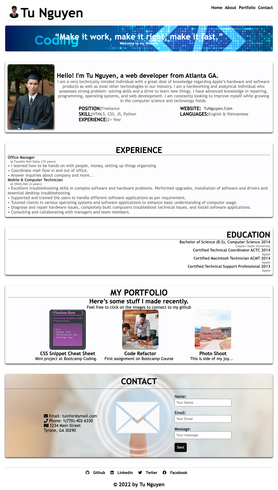

# Professional-Portfolio
This repository holds the contents of my personal site
# Dependencies
 - HTML
 - CSS
 # Usage
 You can run a local copy of this site by issuing the following commands. 
```bash
$ git clone https://github.com/vi3t4lov3/HW2-Professional-Portfolio.git
$ cd HW2-Profeeional-Portlolio
```
## Contributing
1. Fork it
2. Create your feature branch (`git checkout -b my-new-feature`)
3. Commit your changes (`git commit -am 'Add some feature'`)
4. Push to the branch (`git push origin my-new-feature`)
5. Create new Pull Request
## Portfolio Link
 https://vi3t4lov3.github.io/HW2-Professional-Portfolio/
## Desktop Demo

## Mobile Demo
